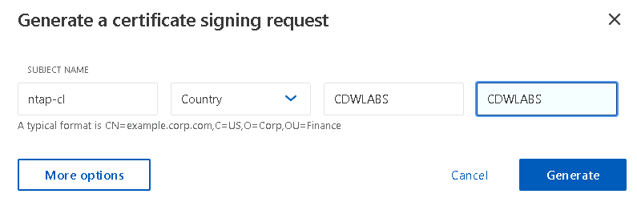
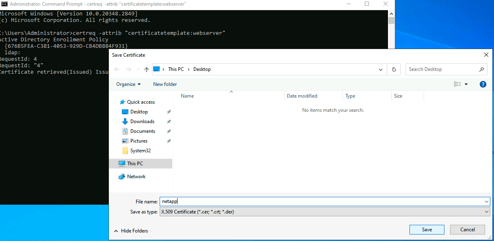

# NetApp Security Hardening

In this lab, you will implement a series of security best practices to harden a NetApp ONTAP environment. This lab focuses on data encryption and protection, network security, and user access controls. This lab caters to individuals with some prior NetApp experience.

## Lab Activities

* Part 1: Schedule and Access Your Lab
* Part 2: Data At Rest Encryption
* Part 3: SMB Storage Provisioning
* Part 4: NFS Storage Provisioning
* Part 5: Routine Storage Administrative Tasks

## Part 1: Schedule and Access Your Lab

1. Navigate to <https://catalog.cdwsdx.com/catalog.php?category_id=19> and select the NetApp Security Hardening lab.

2. You will need to login to schedule the lab.  If you don't have an account you can create one by selecting the `Sign up` link at the bottom of the login box.

3. Access the lab by following the instructions that were emailed to you.

## Part 2: Data at rest encryption

1. On the lab jumpbox, launch the NTAP shortcut.  This shortcut will take you to the NetApp System Manager web interface.

2. You will get a "Your connection is not private" message, select advanced and then click Proceed.

3. Input your credentials and click Sign In.
    * Username - admin
    * Password - Use the password listed within the my labs section.

4. Upon successful login you will be directed to the System Manager Dashboard.  The Dashboard provides a overview of the cluster's overall health and configuration.  You will notice the controller model, in this case it's virtual, capacity, system performance and network details.  Currently these panels don't contain any information as we haven't configured anything.

5. One of the first tasks we will perform is Preparing Storage.  When we prepare the storage it is going to create aggregates/local tiers.  We will store virtual machine and user data in the local tiers.
      * A) Select Prepare Storage from the dashboard.
      * B) Within the Prepare Storage screen it will ask if you want to enable software encryption. Software encryption ensures your data is stored encrypted at rest.  When we configure software encryption we can apply it at a volume and or aggregate/tier level.  For most use cases you are going to apply it to the aggregate/tier. By applying at the aggregate/tier level you ensure that storage efficiencies aren't lost.
      * C) You will need to generate a random 32 character passphrase. You can generate a random phrase by opening a new tab in Chrome and going to <https://www.keepersecurity.com/features/passphrase-generator/>.  Change the words to 8 and then copy the passphrase.
      
      * D) With the passphrase copied to your clipboard go back to the NetApp System Manager tab and paste that passphrase in the configure key manager section under onboard key manager and click prepare storage.
      
      * C) You will be redirected to the dashboard and you should be able to see available capacity in the capacity panel.
      
      * F) Let's validate that our aggregate/tier is configured with encryption. Within system manager navigate to storage / tiers.  Click on the tier that's listed to get more details, validate that encryption status shows enabled.
      

## Part 3: System Manager Hardening

1. From within the System Manager interface navigate to Insights on the lefthand side. You will see a few action item cards within this screen.

2. Let's configure a login banner message when people attempt to access the cluster. Hover over the login banner card and select Fix It. You will be prompted to input a Login banner message. You can place anything you want in here, select apply to cluster login and then click enable.

3. Let's configure our NTP servers. The recommendation is to have at least 3 NTP servers so that we have redundancy and accuracy. For this lab there is already one NTP server configured for you.  We will add two other NTP servers to this list. While this is acceptable for this lab you would want to confirm NTP servers in your environment.

4. Let's enable FIPS 140-2 compliance. By enabling FIPS 140-2 we ensure that SSL communication to system manager occurs with secure TLS versions.

      

5. We are not going to configure cluster notifications in the lab.  If this was a production environment we would want to ensure a syslog or SMTP server was configured for alerts.

6. Let's generate and configure a certificate from our internal certificate authority.  We are doing this to ensure the HTTPS communication with the cluster is valid and secure.
      * A) We will need to generate a certificate signing request from the ONTAP cluster to import into our certificate authority.  Navigate to Cluster / Settings and then click on certificates under Security. At the top of the certificates menu you should see a Generate CSR button, click on that button.
      
      * B) Under generate certificate signing request put in the following.
        * Subject Name - ntap-cl
        * Country - United States
        * Organization - CDWLABS
        * Organizational unit - CDWLABS
      
        * Select the More options button as we need to define further settings.
        * Scroll down to the bottom where it shows Subject Alternative Names (SAN) and click add.  Under DNS server you will put in the DNS name of the system manager interface. You can get this name from the URL in your browser. Select Generate
      
        * Once the request is generated you will select Export to file.  You might get a pop-up on your browser asking to approve multiple file downloads.  Select allow as we will need both the certificate signing request and private key. Once the files are downloaded you can close the certificate signing request window by clicking close.  Verify the files downloaded by opening File Explorer and looking in the downloads directory. Make sure you have a file called csr.pem and privateKey.pem.  You will select the csr.pem file and copy it.
      
      
      * C) Now we will need to login to our certificate authority, copy the certificate and sign the request to generate the certificate. CClick within Type here to Search on the bottom left of your desktop window. Type mstsc in the search box and then click on the Remote Desktop Connection application
      
      * D) In the Remote Desktop Connection window you will need to put in the IP address for your certificate authority server.  The IP address will be the lab subnet found under My Labs on the SDx Labs site with a .100 at the end, e.g. 10.242.243.100. Select the connect button.
      
      * E) You will be prompted for credentials. Input the following credentials and then select ok.
        * Username - Administrator
        * Password - Use the password listed within the my labs section
      
      * F) Once you are logged into the certificate authority server select Yes to allow your PC to be discoverable if prompted and close the Server Manager dashboard. You will need to paste the csr file you copied in step 6B to the desktop, ctrl+v.
      * G) Now we will need to process the certificate request.  On the certificate authority server you will need to open a command prompt and run the following command. certreq -attrib "CertificateTemplate:WebServer" a popup should appear asking you for the CSR file, select the file you copied over to the desktop. You will need to change the file type to all files in the bottom righthand side of the popup and click Open. Select the only available certification authority and click ok. On the Save Certificate popup put a filename of NetApp in and select save.
      
      
      
      * H) Now we need to export the root certificate authority cert to import in the NetApp along with the NetApp cert you saved in step G. On the certification server click within Type here to Search on the bottom left of your desktop window, type certification authority and then click on the Certification Authority application. Right click on the server name and select properties. Under the general tab select view certificate, click on the details tab of that certificate and select copy to file. Select next on the export wizard, select Base-64 encoded x.509 and select next.  In the file to export screen select browse, select your desktop and then put in ca_cert for the file name and click save, click next and finish. You should get a popup stating the export was successful. Click ok and then close the certification windows.
      
      
      
      
      
      * I) Now we will copy the certs and install them.
        * On the certification authority server we will need to navigate to the desktop and copy both the NetApp and ca_cert files we created.  
        
        * Once those are copied we will minimize the remote desktop window and paste the files in our downloads directory.
        
        * Now open up the NetApp System Manager webpage, you should still be in the Certificates section.  Select Add under trusted certificate authorities and give the name lab-cert-authority and the same common name.  Select import under the certificate details, on the popup select your downloads folder and select the ca_cert file you copied over. It will populate the certificate details and then you can click on add.
        
        * Under Certificates select the client/server tab. Select the add button, populate the certificate name and common name with ntap-cl. Under the certificate details click import and select the NetApp key you copied over from the certification server and click open. Under the private key select import and select the priveKey.pem file you exported from the NetApp, click open and then select the save button.
        
        * J) Next we will need to configure the NetApp to use the new certificate we installed.  Click within Type here to search on the bottom left and type putty.  Click on the putty icon and type in ntap-cl and hit open. Accept the host key when the security popup opens. Login with the following information
            * Username - admin
            * Password - Use the password listed within the my labs section
        
        
        * We will need to modify the certificate the cluster management interface is using.
        * Issue the next command, you will need to change your vserver, ca, and serial.  If you try and tab complete this, it will populate with incorrect information.  If you delete this information and hit tab again, it usually resolves this issue.  You can find the correct serial number in System Manager within Cluster, Settings, then under Security select Certificates and select Client/server certificates.  The correct ca is without -ntap at the end.
            * ssl modify -vserver lab242-243-ntap -ca lab242-243.lab -serial 4A000000044900AF3626173072000000000004 -common-name ntap-cl -server-enabled true
        
        * Now that we have the certificate installed on the NetApp close your Chrome browser. Once it's closed click on the NTAP desktop shortcut and verify that the certificate is valid. Also notice our login banner.
        

## Part 4: User security and verification

1. Lets create a new admin account, lock the default admin account and enable SSH security. By locking the default admin account we remove a well-known account that could be targeted.
      * A) From within system manager click on cluster / settings, scroll down to security and select users and roles.
        * Under users click the Add button
        * Leave the target product System Manager
        * For the username type in cdwlabs
        * For the role leave the default admin role selected
        * Under applications select add and make sure the following applications are listed with the authentication type of password.
        
        * For the password use the password listed within the my labs section and then hit save
      * B) In the top right of the system manager page select the user icon and sign out
        
        * Login using the new user account you created in step 4A.
        * Make sure you are still in Cluster / Settings / Security and users and roles
        * If you click on the 3 dots next to admin user you can select lock it.  Confirm the lock user dialog box.
        
        
      * C) Let's add a second authentication method for our new user to login via SSH.
        * Click within Type here to Search on the bottom left and type in putty.  Click on the putty icon and type in ntap-cl and hit open. Accept the host key when the security popup opens. Login with the following information
            * Username - cdwlabs
            * Password - Use the password listed within the my labs section
        * Click within Type here to Search on the bottom left and type in puttygen
        * In the Putty Key Generator window change the parameters from RSA to ECDSA and then click Generate.  Move your mouse cursor around the screen to generate the key. Click save private key.
        * It will ask if you want to save the key without a passphrase, select yes. Save this file on your desktop and label it private_key. Make sure to keep your Putty Key Generator open as you will need the public key in the next step.
        
        * Go back to your putty SSH session to the NetApp. 
        * Run the following command to configure a second authentication SSH authentication method for the cdwlabs user.
          * security login modify -user-or-group-name cdwlabs -application ssh -authentication-method password -second-authentication-method publickey
        * Run the following command to define a public key for the cdwlabs user.
        * When you copy your key from puttygen make sure to not select ecdsa-key-20241230 at the end.
          * security login publickey create -username cdwlabs -application ssh -index 0 -publickey "Paste your puttygen public key here, make sure you have open and close double quotes"
        
        * Click within Type here to Search on the bottom left and type in putty.  Click on the putty icon and type in ntap-cl and hit open. Try to login using the cdwlabs user, you should get an error message stating No supported authentication methods available since we didn't send our private key.
        * Click within Type here to Search on the bottom left and type in putty.  Click on the putty icon and type in ntap-cl. Before selecting open go to the left side and expand Connection / SSH / Auth and select Credentials. Select browse for the private key file for authentication and select the private_key that you saved on your desktop. Now you can select open.
        
          
        * Login with the following information
            * Username - cdwlabs
            * Password - Use the password listed within the my labs section
        * Notice that you can login since you provided the private key.
        
2. Lets create another user and turn on multi-admin verification. Multi-admin verification ensures that critical administrative actions are authorized and reviewed by multiple administrators before an action is executed.
      * A) From within system manager click on cluster / settings, scroll down to security and select users and roles.
        * Under users click the Add button
        * Leave the target product System Manager
        * For the username type in mav1
        * For the role leave the default admin role selected
        * For the User login methods change the application of console to HTTP
        * For the password use the password listed within the my labs section and then hit save
        
      * B) From within system manager click on cluster / settings, scroll down to security and select Multi-admin approval.
        * Create a approval group by clicking add
        * Give the approval group a name of admins
        * Select the cdwlabs and mav1 account in the approvers list
        * Don't populate an email address as there isn't a mail server available for this lab
        * Select the checkbox to make this the Default group
        
        * Delete the default rules that are defined as we will create our own
        * Add a new rule by clicking add
        * Under operation select volume delete
        * Leave the query field blank
        * Under required approvers type in 1
        * Under approval groups select the admins approval group we created in the step above
        * Now create another rule for volume snapshot delete
        * Select the Enable button
        
      * C) In order to test multi-admin verification we will need to create an Storage VM (SVM)
        * From within system manager click on storage and select Storage VMs
        * Click add
        * Give the Storage VM a name of cdwlabs
        * Select the checkbox to enable NFS
        * For now we are not going to allow NFS client access
        * Leave the default language to c.utf_8
        * Create a network interface. The IP address will be the lab subnet with a .62 at the end
        * Leave the subnet mask as 24
        * There's no need to add a gateway for this lab
        * Leave the Broadcast Domain and Port as Default
        * Select the save button
        
        * With our SVM created we can now create a volume.  Select storage and then click volumes.
        * Click the Add button to create a new volume
        * Give the volume a name of nfs1 with a size of 20GiB and click save
        
        * Now let's try to delete the volume we just created
        * Click on the 3 dots next to nfs1 volume and select delete
        * Confirm you want to take the volume offline and delete the data by selecting the check boxes and then click delete
        * You should get an error in the top right corner stating the operation cannot be performed because the request was sent for approval. This is due to the multi-admin verification rules we setup earlier.
        
        * Let's login as the other admin user we created and approve the request.
        * Open a Chrome incognito window and type in https://ntap-cl, it should auto populate the rest of the URL.
        * Accept the dialog box and login as the user we created in step 2A.
        * Once you are logged in go to Event & Jobs and select Multi-admin requests
        * Review the request and then select approve
        
        * Now that the request is approved switch back over to your non-incognito Chrome browser
        * Notice how the volume is still there? We will need to delete the volume again as the request has now been approved
        * Notice how the volume is deleted now?

## Part 5: SMB Setup and Anti-Ransomware

1. Lets enable the SMB protocol on the existing SVM we created earlier.
      * A) From within system manager click on Storage and then select Storage VMs
        * Click on the cdwlabs SVM
        * In the righthand window select settings
        * Under protocol click on the gear icon under SMB/CIFS
        * Administrator name - Administrator
        * Password - Use the password listed within the my labs section.
        * Server Name - cdwlabs
        * Active Directory Domain - You can get this from the URL in your system manager browser. After the ntap-cl you will see the domain name.
        
        * Organizational Unit - Use the default CN=Computers
        * Domains - Leave the default domain that's in there, if there isn't one, copy the Active Directory Domain name from the previous step.  
        Name Servers - Leave the default that's in there, if there isn't one, it will be your lab subnet with a .100 at the end.
        * Select the checkbox to reuse the data interface used for the NFS or S3 protocol. Select the drop down and click on the interface we created earlier.
        * Select the save button.

          
        * Now we are going to secure communication to the NetApp by enabling signing and encryption. On the SMB/CIFS card in the protocols section click on the arrow.
        * Click on edit SMB/CIFS settings
        * Select the checkboxes for signing required and encrypt data, click on save.
        

2. Lets configure a share and enable Anti-Ransomware. We will then simulate a ransomware attack.
      * A) From within system manager click on Storage and then select volumes.  Click on Add at the top left of the screen.
        * Give the volume a name of share
        * Give the volume a capacity size of 10GiB
        * Uncheck Export via NFS and leave share via SMB/CIFS checked.
        * Select save

        
      * B) From within system manager click on Storage and then select volumes.
        * Open windows file explorer and explore the share you just created. To get the path to the share click on the volume name within system manager, within the overview section scroll down and copy the SMB/CIFS Access path. Paste that path within windows file explorer.
         
      * C) Download 2 PowerShell scripts to create files and simulate an attack.
        * https://github.com/sdxic/netapp_security_hardening/blob/master/create%20files.ps1
        * https://github.com/sdxic/netapp_security_hardening/blob/master/encrypt%20files.ps1
        * Right click the create files PowerShell script and select run with PowerShell.  Type Y for yes if prompted about Execution Policy Change.  This will create files in the share you viewed in the previous step.  After the script completes browse the share and verify you can see files.
        * From within system manager click on Storage and then select volumes
        * Click on the volume we created before named share and then select the security tab.
        * Change the status of Anti-ransomware from disabled to enabled
        * Click the Event severity settings cogwheel. Change the Created a ransomware snapshot from don't generate to Notice, select save
         
        * Now we are going to encrypt the files that we just created.  Right click the encrypt files PowerShell script and select run with PowerShell.  This will encrypt and rename the files we just created.
        * Once the script completes view the contents of a file on that share. The file should now contain encrypted text and the file was renamed.
        
        * Go back to system manager and view the snapshots for the share volume.  You should see a snapshot titled Anti_ransomware_backup. Select the Anti_ransomware_backup snapshot and restore it. Once it's restored you should see most of the files are back to their state before being encrypted.
        
